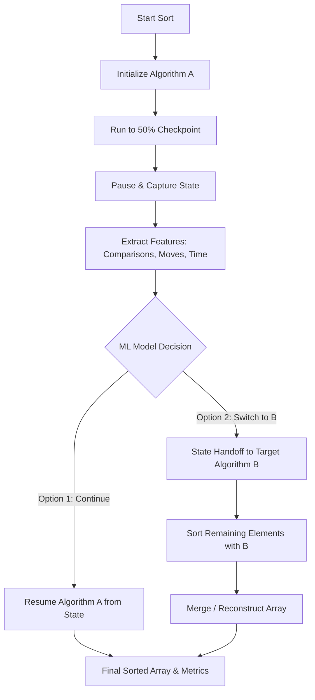

# Project Guide: Mid-Execution Adaptive Sorting via Machine Learning

Welcome to the **Adaptive Sorting Research** codebase! This document is a comprehensive guide to help you understand the architecture, algorithms, execution flow, data design, and key research concepts behind this project.

---

## 1. Research Overview & Goal

The core objective of this research is **Mid-Execution Sorting Adaptation via Machine Learning**. 

### The Problem
Traditional sorting algorithms (like QuickSort, MergeSort, or InsertionSort) excel under specific input distributions but perform poorly under others. Hybrid algorithms (such as TimSort or IntroSort) improve on this by switching strategies using hand-crafted static heuristics (e.g., switching from QuickSort to HeapSort if recursion depth exceeds a threshold). 
However, both traditional and hybrid methods commit to a strategy before or at the start of execution. They cannot observe actual runtime behavior (like comparison rates, move rates, and data distribution features) to make dynamic, mid-execution decisions.

### Our Approach
Our system starts sorting an array with a default algorithm, pauses at a **50% execution checkpoint**, extracts runtime features (comparisons, moves, elapsed time, progress rate), and evaluates if it is beneficial to:
1. **Continue** with the original algorithm to completion, OR
2. **Switch** to a different, more optimal algorithm at the checkpoint to sort the remaining elements.

Ultimately, a Machine Learning model (Decision Tree or Random Forest) will be trained on the extracted features and switching costs to automate this decision-making process at runtime.

---

## 2. Core Concepts & Terminology

- **Comparison Count (`comparisons`)**: The total number of element-to-element comparisons performed.
- **Move Count (`moves`)**: The total number of element write operations.
  - *Convention*: 1 element write = 1 move. A swap (`a, b = b, a`) involves 2 writes, so it is counted as **2 moves** (not 3).
- **Overhead**: The computational cost (in comparisons, moves, and milliseconds) incurred during a switch due to data slicing, helper allocation, and list merging.
- **Comparison Rate (`comparisons / n`)**: The ratio of comparisons to the array size $n$. This ratio acts as a primary feature signal for the ML model, indicating if the algorithm is degrading (e.g., QuickSort approaching $O(n^2)$).

---

## 3. Project Directory Map

Here is the structural organization of the codebase:

```
adaptive-sorting-research/
├── src/
│   ├── algorithms/           ← Pure, clean sort implementations (used by correctness tests)
│   │   ├── insertion_sort.py
│   │   ├── merge_sort.py
│   │   └── quick_sort.py
│   ├── algorithm_metrics/    ← Instrumented versions (record comparisons, moves, and time)
│   │   ├── insertion_sort.py
│   │   ├── merge_sort.py
│   │   └── quick_sort.py
│   ├── checkpoint/           ← Mid-execution checkpointing, state management, & resuming
│   │   ├── runner.py                  ← Public API wrapper for run-to-checkpoint & switch/continue
│   │   ├── insertion_sort_checkpoint.py  ← Checkpoint and resume logic for InsertionSort
│   │   ├── merge_sort_checkpoint.py      ← Checkpoint and resume logic for MergeSort
│   │   └── quick_sort_checkpoint.py      ← Checkpoint and resume logic for QuickSort
│   ├── datasets/             ← Dataset generation scripts
│   │   ├── generator.py       ← Helper functions for generating different array patterns
│   │   └── create_datasets.py ← Script to generate and save datasets to data/
│   └── data_loader.py        ← Utility to load generated datasets
├── data/                     ← Saved JSON datasets (sizes 100 to 10,000 across 7 patterns)
├── results/                  ← Output of the benchmark runs (JSON files)
├── tests/                    ← Correctness and checkpoint verification scripts
├── benchmark.py              ← The core benchmarking engine evaluating switching/continuation paths
├── main.py                   ← CLI entry point to run benchmarks
├── findings.md               ← Empirical insights and results from Phase 1
├── gemini.md                 ← Developer memory and conventions
└── requirements.txt          ← Python dependencies
```

---

## 4. The 50% Checkpoint Architecture

Because different sorting algorithms work in fundamentally different ways, defining and executing a "50% checkpoint" is non-trivial. The project implements customized checkpoint strategies for each of the three core algorithms:

### 1. Insertion Sort Checkpoint
* **Definition**: Pauses when the outer loop index `i` reaches `n // 2`.
* **State at Checkpoint**: The left subarray `arr[0 : n // 2]` is sorted relative to itself, and the right subarray `arr[n // 2 : n]` is completely untouched.
* **Source**: [insertion_sort_checkpoint.py](file:///Users/nievanik/Desktop/Summer_Research/adaptive-sorting-research/src/checkpoint/insertion_sort_checkpoint.py)

### 2. Merge Sort Checkpoint
* **Definition**: Pauses after recursively sorting the left half of the array `arr[:n // 2]` to completion.
* **State at Checkpoint**: The left half `arr[0 : n // 2]` is fully sorted, and the right half `arr[n // 2 : n]` is untouched.
* **Source**: [merge_sort_checkpoint.py](file:///Users/nievanik/Desktop/Summer_Research/adaptive-sorting-research/src/checkpoint/merge_sort_checkpoint.py)

### 3. Quick Sort Checkpoint
* **Definition**: QuickSort is implemented iteratively using an explicit stack of subproblem ranges `(low, high)`. The checkpoint pauses when the comparison count reaches a predefined comparison budget:
  $$\text{Budget} = \frac{n \log_2(n)}{2}$$
  This budget approximates 50% of the comparisons required in the average case.
* **State at Checkpoint**: The array is partially partitioned. A list of unresolved subproblem ranges `(low, high)` that still need partitioning is stored in a stack (`remaining_stack`). Elements not inside any subproblem range in the stack are already in their final sorted positions.
* **Source**: [quick_sort_checkpoint.py](file:///Users/nievanik/Desktop/Summer_Research/adaptive-sorting-research/src/checkpoint/quick_sort_checkpoint.py)

---

## 5. Continuation vs. Switching Logic

Once a sorting algorithm reaches its checkpoint, it produces a state dictionary containing the current array layout, metrics accumulated so far, and the necessary state markers (e.g., stack or split indices). Execution can progress along two paths:

### Path A: Continuation (`continue_sort`)
Resumes the original algorithm from its checkpoint state to completion:
* **Insertion Sort**: Continues the outer loop index `i` from `n // 2` to `n` in place.
* **Merge Sort**: Recursively sorts the right half `arr[n // 2:]` and then merges it with the already-sorted left half.
* **Quick Sort**: Continues popping subproblems from `remaining_stack` and partitioning them until the stack is empty.

### Path B: Switching (`switch_sort`)
Transfers the partial state to a target algorithm to finish the sort. The transition mechanism depends on the structure of the checkpoint state:

#### 1. Switching from Split-State Checkpoints (Insertion Sort & Merge Sort)
Both Insertion Sort and Merge Sort checkpoints split the array into a sorted left half and an untouched right half. The switch mechanism is:
1. **Sort the untouched right half** `arr[sorted_end:]` using the chosen target algorithm.
2. **Merge** the sorted left half and the newly sorted right half using MergeSort's merge procedure.
3. *Overhead*: Slicing the right half, sorting it, and merging the two halves adds setup and merge overhead (measured as `overhead`).

```
[ Sorted Left Half (50%) ]   [ Untouched Right Half (50%) ]
           |                                |
           | (already sorted)               | (sort using target algorithm)
           |                                v
           |                    [ Sorted Right Half ]
           \                                /
            \                              /
             v                            v
             [  Merge both sorted halves  ]
```

#### 2. Switching from Quick Sort (Stack-State Checkpoint)
QuickSort's checkpoint leaves the array partially partitioned with multiple unresolved subarray ranges stored in the `remaining_stack`. The switch mechanism is:
1. Iterate through each unresolved boundary `(low, high)` in the `remaining_stack`.
2. Extract the subarray `arr[low : high + 1]`.
3. Sort this subarray fully using the target algorithm.
4. Write the sorted subarray back into `arr[low : high + 1]` in-place.
5. *Overhead*: Slicing subproblems and reconstructing the array in-place.

```
       Partially partitioned array at QuickSort checkpoint:
[ Sorted Element ] [ Unresolved Subproblem 1 ] [ Sorted ] [ Unresolved Subproblem 2 ]
                           |                                        |
                  (sort with target algo)                  (sort with target algo)
                           v                                        v
                 [ Sorted Subproblem 1 ]                  [ Sorted Subproblem 2 ]
```

---

## 6. Execution Call Hierarchy & Detailed Mechanics

Understanding which files run first, how they call one another, how checkpoint stopping is accomplished, and how tradeoffs are calculated is key to understanding this repository's execution mechanics.

### 1. File Execution & Call Hierarchy

When running tests or benchmarks, the execution order and file references are structured as follows:

```
[User Trigger] ──> [Entry File] ──> [Benchmark Engine] ──> [Unified Runner] ──> [Checkpoint Modules]
```

#### Path A: Running Tests
1. **User runs** `python tests/test_checkpoint.py` (or other test files).
2. **The test script** executes individual test suites (e.g., testing correctness of continuation, or all 9 combinations of algorithm switching).
3. **The test script calls** functions directly from [runner.py](file:///Users/nievanik/Desktop/Summer_Research/adaptive-sorting-research/src/checkpoint/runner.py):
   - `run_to_checkpoint(algo_name, arr)`
   - `continue_sort(state)`
   - `switch_sort(state, target_algo)`
4. [runner.py](file:///Users/nievanik/Desktop/Summer_Research/adaptive-sorting-research/src/checkpoint/runner.py) imports and dispatches these calls to their corresponding algorithm-specific checkpoint modules:
   - [insertion_sort_checkpoint.py](file:///Users/nievanik/Desktop/Summer_Research/adaptive-sorting-research/src/checkpoint/insertion_sort_checkpoint.py)
   - [merge_sort_checkpoint.py](file:///Users/nievanik/Desktop/Summer_Research/adaptive-sorting-research/src/checkpoint/merge_sort_checkpoint.py)
   - [quick_sort_checkpoint.py](file:///Users/nievanik/Desktop/Summer_Research/adaptive-sorting-research/src/checkpoint/quick_sort_checkpoint.py)

#### Path B: Running Benchmarks
1. **User runs** `python main.py --algo <algos> --size <sizes>`.
2. `main.py` parses arguments and calls `run_benchmark()` inside [benchmark.py](file:///Users/nievanik/Desktop/Summer_Research/adaptive-sorting-research/benchmark.py).
3. For each requested algorithm, dataset size, and pattern, [benchmark.py](file:///Users/nievanik/Desktop/Summer_Research/adaptive-sorting-research/benchmark.py) executes:
   - **Data loading**: Calls `load_dataset()` from [data_loader.py](file:///Users/nievanik/Desktop/Summer_Research/adaptive-sorting-research/src/data_loader.py), which reads the generated JSON arrays from files in the `data/` directory.
   - **Core running**: Calls `run_sort_with_checkpoint(algo_name, arr)`, which calls:
     - `run_to_checkpoint(algo_name, arr)` from [runner.py](file:///Users/nievanik/Desktop/Summer_Research/adaptive-sorting-research/src/checkpoint/runner.py).
     - `continue_sort(state)` from [runner.py](file:///Users/nievanik/Desktop/Summer_Research/adaptive-sorting-research/src/checkpoint/runner.py).
     - `switch_sort(state, target_algo)` from [runner.py](file:///Users/nievanik/Desktop/Summer_Research/adaptive-sorting-research/src/checkpoint/runner.py) (once for each alternative algorithm).
   - **Result saving**: Calls `save_results()` to serialize the collected metrics into `results/<algorithm_name>/<size>.json`.

---

### 2. How the Checkpoint Stops/Pauses Code Execution

In Python, a running execution context or a recursive call stack cannot be natively paused and resumed mid-execution without incurring complex overhead (e.g., using generator coroutines or multi-threading). 

To keep the codebase performant and mathematically clean, we designed the checkpoint modules to be **structurally decoupled** into two distinct execution phases:

1. **`run_to_checkpoint(arr)`**: Runs a modified version of the algorithm that performs exactly 50% of the work and exits returning the state dictionary.
2. **`resume(state)` or `switch_sort(state, target)`**: Uses the state dictionary markers to finish sorting.

#### The Pausing Mechanisms:
- **Insertion Sort**: We replace the standard outer loop `for i in range(1, len(arr))` with `for i in range(1, checkpoint_i)` where `checkpoint_i = n // 2`. The function then exits by returning the array and setting `"sorted_end": checkpoint_i` in the state dictionary. To resume, a separate loop is run starting from `checkpoint_i` to `n`.
- **Merge Sort**: In standard recursive MergeSort, the first call divides the array into left and right halves. We call the recursive function `_merge_sort_tracked(arr[:mid])` to sort *only* the left half. We write this sorted half back and return immediately, without calling the right half recursion and without merging. This cleanly stops execution at exactly 50% progress.
- **Quick Sort**: Standard recursive QuickSort cannot easily be paused. We therefore use an **iterative stack-based QuickSort** (`while stack:`). We count comparisons inside the partition loop. Once `comparison_count >= budget` (where $\text{budget} = \frac{n \log_2(n)}{2}$), we break out of the loop and return immediately. The active subproblem stack is returned inside the state dictionary as `remaining_stack`.

---

### 3. How Switching Occurs

When switching is requested at the checkpoint, [runner.py](file:///Users/nievanik/Desktop/Summer_Research/adaptive-sorting-research/src/checkpoint/runner.py) reads the state dictionary and executes the handoff based on the checkpoint structure:

- **Switching from Split-State (Insertion & Merge Sort)**:
  1. The left half is already sorted, and the right half `arr[sorted_end:]` is untouched.
  2. The untouched right half is passed to the target algorithm's sorting function (e.g., `_sort_tracked(right)`).
  3. Once the target algorithm returns the sorted right half, we run a tracked merge function (`_merge_tracked`) to combine both sorted halves into a single list.
- **Switching from Stack-State (Quick Sort)**:
  1. The array is partially partitioned in-place, and the boundaries of unresolved subproblems are stored as `(low, high)` tuples in the `remaining_stack`.
  2. For each tuple in the stack, we slice out the subproblem `arr[low : high + 1]`.
  3. We sort this subproblem fully using the target algorithm.
  4. The sorted subarray is written back in-place into `arr[low : high + 1]`. Elements outside of these ranges are already in their final correct sorted locations.

---

### 4. How Performance Tradeoffs & Overhead are Calculated

To decide if switching was beneficial, we evaluate the performance tradeoffs (comparisons, moves, and wall time) along the switch path versus the continuation path. 

For any run, the total execution cost is composed of:
1. **Checkpoint Stage Costs**: Metrics generated during the initial algorithm's run to 50%.
2. **Pure Sorting Costs**: Work done strictly within the target algorithm to sort the remaining parts of the array.
3. **Overhead Costs**: Data slicing, list reconstruction, constructor setup, and merging costs incurred to perform the switch.

#### Mathematical Formulas:
- $\text{Total Comparisons} = \text{Checkpoint Comparisons} + \text{Post-checkpoint Comparisons}$
- $\text{Total Moves} = \text{Checkpoint Moves} + \text{Post-checkpoint Moves}$
- $\text{Total Time (ms)} = \text{Checkpoint Time} + \text{Post-checkpoint Time}$

#### Calculating the Switching Overhead:
- **Overhead Comparisons / Moves**: 
  - For Split-State switches (Insertion/Merge to target): The overhead is exactly the comparison and move counts of the final merge step (`_merge_tracked`), since merging is not part of pure sorting.
  - For Stack-State switches (QuickSort to target): Since the unresolved subarrays are sorted in-place, there is no merge step, so overhead comparisons/moves are $0$.
- **Overhead Time**:
  - Let $T_{\text{total\_post}}$ be the total elapsed time of the switch operation (from the start of handoff to the final sorted array).
  - Let $T_{\text{pure\_sort}}$ be the sum of time spent strictly inside the target algorithm's sort functions.
  - The timing overhead is calculated as:
    $$\text{Overhead Time (ms)} = T_{\text{total\_post}} - T_{\text{pure\_sort}}$$
  - This measures the actual cost of list slicing, function dispatch, list constructors, and merging.

---

## 7. Execution Flow & Lifecycle

The execution lifecycle of a single sorting run is shown below:



---

## 8. Data Generation & Benchmarking

### Dataset Structure
The benchmark evaluation is powered by a custom dataset pipeline generating 5 sizes ($100, 500, 1000, 5000, 10000$) across 7 distribution types:
1. **`random`**: Randomly generated values.
2. **`sorted`**: Ascending values ($0, 1, \dots, n-1$).
3. **`reverse_sorted`**: Descending values ($n, n-1, \dots, 1$).
4. **`nearly_sorted`**: Sorted array with a small number of random index swaps (simulating partial order).
5. **`duplicate_heavy`**: Values restricted to a small number of unique integers (high frequency of repeats).
6. **`all_equal`**: Every element is identical.
7. **`edge_cases`**: Empty arrays and single-element arrays.

### Benchmark Engine (`benchmark.py`)
For a given size and set of algorithms, the benchmark:
1. Loads the dataset for a specific size and type.
2. Runs the primary algorithm to its checkpoint, recording checkpoint metrics.
3. Simulates the **continuation** path to completion.
4. Simulates **switching** to both alternative algorithms.
5. Captures comparisons, moves, and time (in ms) for every path, alongside setup/merging overhead.
6. Saves the compiled results to `results/<algorithm_name>/<size>.json`.

---

## 9. Key Empirical Findings (Phase 1)

Empirical evaluations from benchmark runs revealed important behavioral characteristics that justify mid-execution switching:

### 1. QuickSort fails on Uniform/All-Equal Data
Even with a random pivot, QuickSort degrades to **$O(n^2)$ complexity** on `all_equal` data.
* *Why*: When all elements are equal, partitioning splits the array into sizes $0$ and $n-1$.
* *Data (n=10,000)*: QuickSort requires **49,995,000 comparisons** taking **4,675 ms** (compared to only 15 ms on random data).
* *ML Decision*: A rapid increase in comparisons at the checkpoint is a strong signal to switch away from QuickSort to MergeSort or InsertionSort.

### 2. InsertionSort is exceptionally fast on Structured Data
On sorted or all-equal datasets, InsertionSort runs in linear time $O(n)$ and out-performs both QuickSort and MergeSort.
* *Data (n=10,000)*: InsertionSort takes **0.93 ms** (9,999 comparisons) compared to QuickSort's 14.2 ms (sorted) or 4,675 ms (all-equal).
* *ML Decision*: If the checkpoint indicates a low comparison/swap count on nearly-sorted data, switching to InsertionSort is highly beneficial.

### 3. MergeSort is a stable fallback
MergeSort is entirely predictable. Its move count is invariant at $n \lceil \log_2(n) \rceil$ for any input sequence.
* *ML Decision*: When feature signals are ambiguous or QuickSort is degrading, MergeSort serves as a safe fallback.

---

## 10. Running and Testing the Pipeline

Ensure your virtual environment is active before running commands.

### Setup
```bash
# Activate virtual environment
source research_env/bin/activate

# Setup Python path
export PYTHONPATH=.
```

### 1. Re-Generate Datasets
If you need to re-generate the dataset JSON files in `data/`:
```bash
cd src/datasets && python create_datasets.py && cd ../..
```

### 2. Run Correctness Tests
To verify the pure algorithms, run the unit tests directly:
```bash
PYTHONPATH=. python tests/test_insertionsort.py
PYTHONPATH=. python tests/test_mergesort.py
PYTHONPATH=. python tests/test_quicksort.py
```

### 3. Run Checkpoint & State Handoff Tests
To verify the correctness of the checkpointing, continuation, and all 9 combinations of algorithm switching:
```bash
PYTHONPATH=. python tests/test_checkpoint.py
```

### 4. Run Benchmarks
To run the benchmarking pipeline and record the switching cost data:
```bash
# Run all algorithms for all sizes
python main.py --algo insertion_sort merge_sort quick_sort --size 100 500 1000 5000 10000

# Run a quick test on a single size
python main.py --algo quick_sort --size 1000
```
Benchmark results are written directly to the `results/` folder as structured JSONs.
